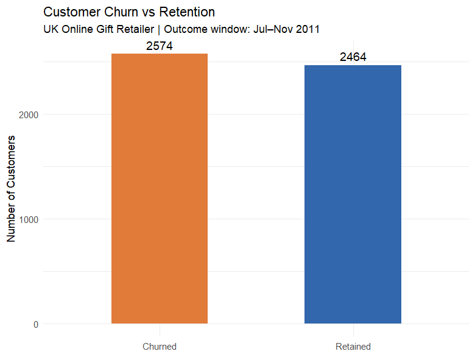
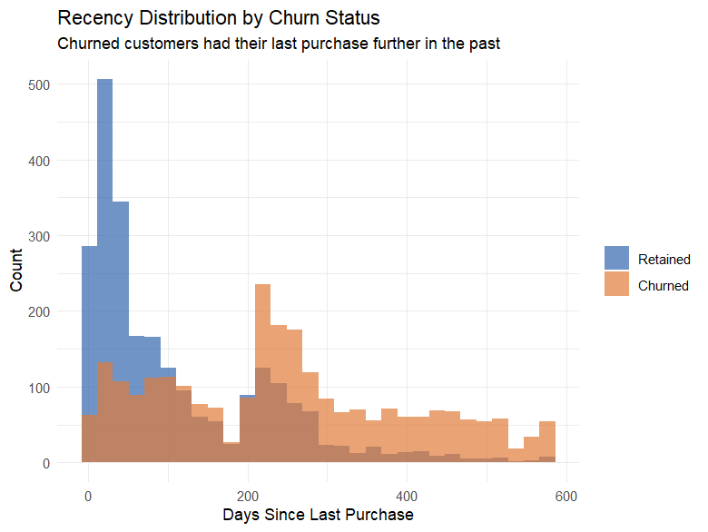
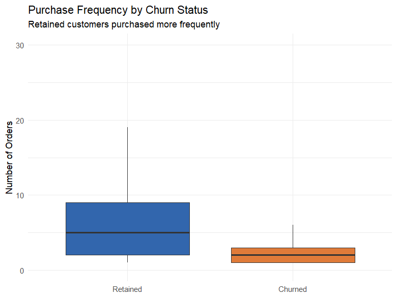
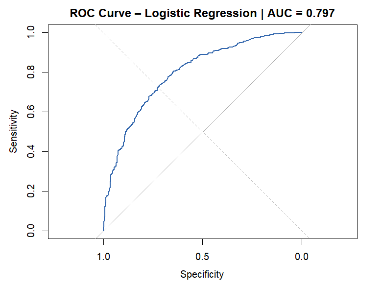
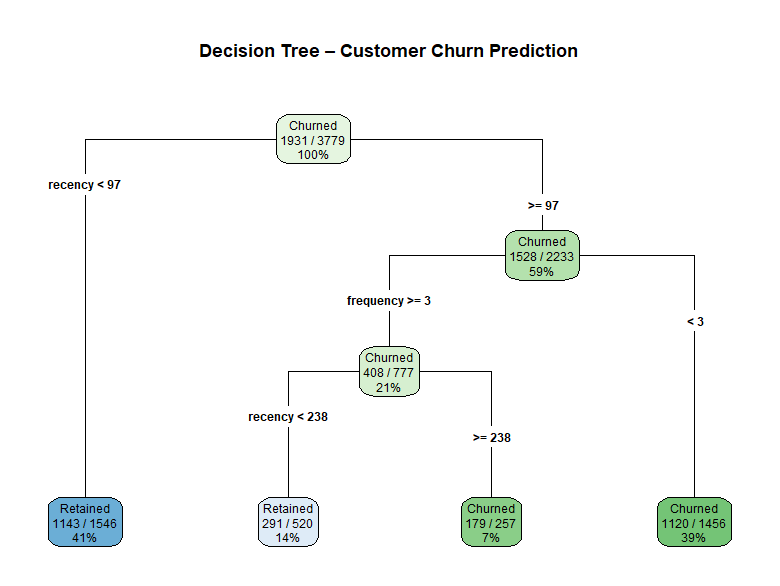

# Customer Churn Prediction — UK Online Gift Retailer

Binary churn classification in R on the UCI Online Retail II dataset: 805,549 cleaned transactions, 5,038 modelled customers, 18 months of purchase history. Logistic regression as the primary model with a decision tree comparison, packaged as an executive brief with deployment recommendations. Built during my MSBA at Hult International Business School.

**Headline results: 72.4% accuracy, 74.3% sensitivity (catches 3 of 4 actual churners), AUC 0.797** — the model ranks a churner above a non-churner ~80% of the time, well above the 50% random baseline.

## The problem

Which customers of a UK online gift retailer are at risk of never buying again — and can we flag them early enough to intervene? With a 51.1% observed churn rate, churn here is not a rare-event problem; it's a mainstream risk affecting most of the customer base, and retention is far cheaper than acquisition.

## Method

**Temporal split, not random split.** Customer-level features were built from an 18-month observation window (Dec 2009 – Jun 2011); the label came from whether each customer purchased in a separate 5-month outcome window (Jul – Nov 2011). This mirrors how the model would actually be deployed — predicting the future from the past — and avoids the leakage a random row split would introduce.

**RFM+T features.** Recency (days since last purchase), Frequency (number of orders), Monetary (total spend), and Tenure (days as a customer), computed per customer from the observation window. 75/25 train/test split (3,779 / 1,259 customers).

**Models.** Logistic regression (primary) vs. decision tree (comparison), evaluated on accuracy, sensitivity, specificity, and AUC.

## Findings

**Recency and frequency predict churn — spending does not.** Each additional day since last purchase raises churn odds by 0.6% (compounding to ~70% higher risk after 90 days of inactivity); each additional order cuts churn odds by 10%. Total spend was not significant: the business cannot protect itself from churn by focusing on its biggest spenders.

**Model choice is a business decision, not just an accuracy contest.** The decision tree edges logistic regression on raw accuracy (73.1% vs 72.4%) but misses far more churners (68% vs 74% sensitivity). Since a missed churner costs more than a false alarm, logistic regression wins.

**The tree still earns its keep as an operational rulebook.** Its splits translate directly into CRM rules a manager can apply with no data scientist present: customers inactive 97+ days with fewer than 3 lifetime orders carry a 77% churn probability.

## Recommendations (from the executive brief)

1. **Score monthly, rank by churn probability**, and flag the top quartile for retention outreach — owned by the CRM/Marketing Analytics team, retrained every 6 months.
2. **Automate re-engagement at 90 days of inactivity** — a discount, recommendation, or loyalty reward, triggered without manual review.
3. **Target the 2–4 lifetime-order segment** with second/third-purchase incentives, since low order count is the strongest behavioral churn driver after recency.

The brief also covers model limitations (single retailer, no seasonality/competitor effects; at 72.4% accuracy the model informs rather than replaces judgment) and ethical guardrails against exploitative retention targeting.

## Tech stack

R · tidyverse · lubridate · caret · pROC · rpart/rpart.plot

## Data

**UCI Online Retail II** (Chen et al., 2012) — public dataset of real transactions from a UK online gift retailer, Dec 2009 – Dec 2011. **Not included in this repository** (the CSV is ~95MB); download it from the [UCI Machine Learning Repository](https://archive.ics.uci.edu/dataset/502/online+retail+ii), then run `churn_model.R`, which prompts for the file via `file.choose()`.

## Notes

Individual capstone assignment, Hult MSBA. The full executive brief (business context, findings, recommendations, risk/ESG considerations) is summarized above.
